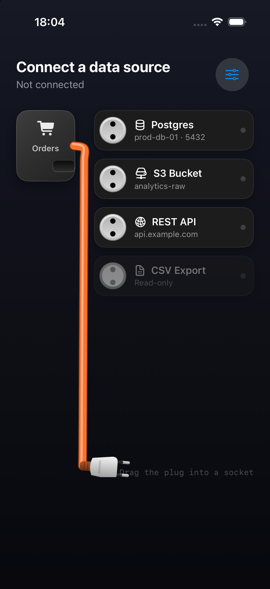
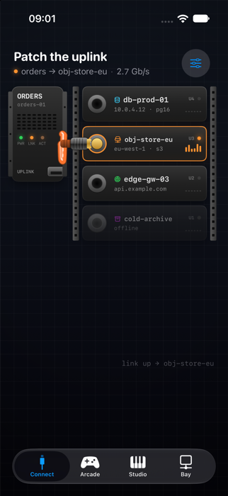
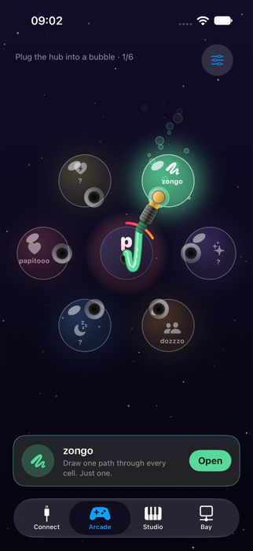
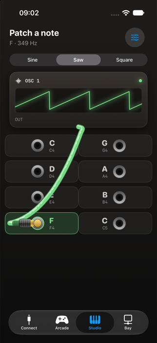
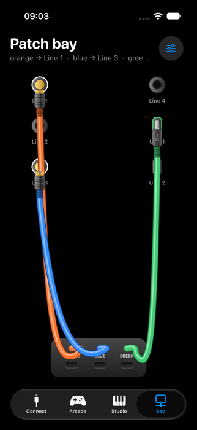

# CableKit

A physical patch cable for SwiftUI. A plug hangs on a rope from a source device; drag it into a socket
and it snaps, slides in and clicks. Tug it or tap it to pull it out. Real rope physics, a rigid plug,
haptics, synthesized sound, nine connector styles, four cable styles (round, coiled, ribbon, neon), light/dark themes, and an optional data-traffic
animation — all configurable, all with sensible defaults.

<p align="center"></p>

<p align="center">
  
  
  
  
</p>
<p align="center"><sub>The four demo tabs — a rack, a ring, a keyboard and a three-cable patch bay — all <code>CableBoard</code>s with the sockets laid out by ordinary SwiftUI.</sub></p>

- **Physics** — Verlet rope with a rigid plug head, floor and wall collisions, take-up-reel slack,
  elasticity, stretch limit, and gravity that can follow the phone's tilt.
- **Interaction** — tip-follows-finger dragging, magnetic snapping with hysteresis, pin insertion and
  ejection, tap-to-connect / tap-to-eject, grab-and-flick the cable itself, VoiceOver support.
- **Any number of cables** on one board — each with its own source, look and physics; sockets take one plug at a time and can restrict which plug styles fit.
- **Feedback** — CoreHaptics patterns (click, pop, ticks, impact, continuous tension) and procedurally
  synthesized sounds with no audio assets. Both replaceable. Optional electric arcs: flickers as you approach a socket, a crackling bolt as you pull out.
- **Look** — nine plugs (audio jack, Europlug, USB‑C, banana, RJ45, MagSafe, RJ11, IDC, neon electrode)
  with matching sockets; custom plugs via a drawing closure; custom cable renderer; full colour theme;
  light and dark out of the box.
- **Data** — bits or real Morse code streaming through the cable while connected.

## Requirements

iOS / iPadOS 17+, macOS 14+, Mac Catalyst 17+; Swift 6.2 / Xcode 26 or later. The package builds in the
Swift 6 language mode; everything is `@MainActor`, including the `CableSoundProvider` and
`CableHapticsProvider` protocols. Haptics, sound and tilt need a real device; tilt gravity
(`gravityFollowsDevice`) is iOS-only, and on the Mac haptics fall back to the trackpad.

## Installation

Swift Package Manager — add the package and `import CableKit`.

```swift
.package(url: "https://github.com/zigzagg16/CableKit.git", from: "1.0.0")
```

## Quick start

```swift
import CableKit

enum DataSource: Hashable { case postgres, s3, api }

struct ConnectView: View {
    @State private var connection: DataSource? = nil

    var body: some View {
        CablePatchView(
            sockets: [
                PlugSocket(id: .postgres, title: "Postgres", subtitle: "prod-db-01", systemImage: "cylinder.split.1x2", tint: .cyan),
                PlugSocket(id: .s3, title: "S3 Bucket", subtitle: "analytics-raw", systemImage: "externaldrive", tint: .orange),
                PlugSocket(id: .api, title: "REST API", systemImage: "network", tint: .green, isEnabled: false),
            ],
            connection: $connection,
            sourceTitle: "Orders",
            sourceSystemImage: "cart.fill"
        ) { event in
            print(event)   // .grabbed, .hover(id), .plugged(id), .unplugged(id), .dropped, .stretched(0…1)
        }
        .frame(minHeight: 340)
    }
}
```

`connection` is two-way: the view sets it when the user connects or disconnects, and setting it
yourself animates the plug in (or ejects it with `nil`). Give the view some height — the floor the
cable rests on is its bottom edge.

## Configuration

Everything lives in `CableConfiguration`. Change a copy and pass it in; changes apply live.

```swift
var config = CableConfiguration()
config.plugStyle = .usbC
config.cable.color = .cyan
config.elasticity = 0.8
config.dataFlow = .morse("SYNC")
config.gravityFollowsDevice = true

CablePatchView(sockets: sockets, connection: $connection, sourceTitle: "Orders", configuration: config)
```

| Area | Property | Default | Notes |
|---|---|---|---|
| Look | `plugStyle` | `.audioJack` | `.europlug`, `.usbC`, `.banana`, `.ethernet`, `.magSafe`, `.telephone`, `.idc`, `.electrode`, or your own `PlugStyle` |
| | `cable` | `CableStyle()` | colour, width, stretch tint/thinning, rim, highlight, shadow, custom renderer |
| | `theme` | `nil` | `CableTheme`; `nil` = light/dark from the system |
| Length | `restLength` | `nil` | `nil` = long enough for every socket and for `hangFraction` |
| | `hangFraction` | `1` | how far down the view a free-hanging plug dangles (1 = floor, 0.7 = 70%); full length still available when dragging / plugged |
| | `maxStretch` | `1.22` | ratio past rest length before the plug stops following |
| | `elasticity` | `0.5` | 0 rope … 1 bungee |
| | `autoSlack` / `slack` | `true` / `36` | take-up reel: cable stays `slack` pt longer than it needs |
| Motion | `gravity` | `2600` | pt/s² |
| | `gravityFollowsDevice` | `false` | Core Motion tilt |
| | `damping` / `dragDamping` | `0.985` / `0.955` | velocity retention free / while dragging |
| | `segmentCount` | `30` | rope resolution |
| Snapping | `snapRadius` | `60` | magnet + highlight range |
| | `hoverSwitchMargin` / `hoverSwitchDelay` | `22` / `0.18` | hysteresis between neighbouring sockets |
| | `unplugDistance` | `38` | tug distance to pop out (a tap ejects too) |
| | `plugHitRadius` | `46` | touch target |
| | `cableGrabEnabled` / `cableHitRadius` / `cableGrabSoftness` | `true` / `16` / `0.55` | grab and flick the cable anywhere along its length; softness = how loosely it's held |
| | `cableGrabStretchFeedback` | `true` | creak + tension haptic when a grabbed cable is stretched |
| Data | `dataFlow` | `.bits` | `.morse("…")`, `.none` |
| | `dataFlowDirection` | `.toSource` | or `.toSocket` |
| | `dataFlowSpeed` / `dataFlowUnit` | `120` / `4` | pt/s, pt per Morse unit |
| | `dataFlowColor` / `dataFlowWidth` / `dataFlowOpacity` / `dataFlowGlow` | white / `0.16` / `0.7` / `0` | |
| Sparks | `spark` | `.unplug` | `.none`, `.plugIn` (flickers on approach + zap on insert), `.unplug` (arc on pull-out), `.both` |
| | `sparkColor` / `sparkDuration` | electric blue / `0.3` | |
| Feedback | `hapticsEnabled` / `soundEnabled` | `true` / `true` | master switches |
| | `haptics` / `sounds` | `nil` | custom providers (see below) |

## Customizing

### Plug styles

A `PlugStyle` is a value: dimensions + a drawing closure + a socket view. Built-ins are presets on the
type; make your own with the same initializer. Drawing happens in plug space (origin at the boot, `+x`
toward the tip), and `PlugArt` provides boots, metals, pins and shadows.

```swift
let stubby = PlugStyle(
    id: "stubby", displayName: "Stubby", length: 48, insertTravel: 10, socketFaceOffset: 8,
    draw: { ctx, plug in
        let boot = CGRect(x: -4, y: -6, width: 18, height: 12)
        let body = Path(roundedRect: CGRect(x: 12, y: -9, width: 24, height: 18), cornerRadius: 4)
        let pin = PlugArt.pin(from: 34, to: 48, halfHeight: 3, clip: plug.clip)   // clipped as it enters the socket
        PlugArt.dropShadow(&ctx, [Path(roundedRect: boot, cornerRadius: 4), body, pin ?? Path()])
        PlugArt.boot(&ctx, rect: boot, plug: plug)
        ctx.fill(body, with: PlugArt.metal(-9, 9))
        if let pin { ctx.fill(pin, with: PlugArt.gold) }
    },
    socket: { s in
        ZStack {
            Circle().fill(s.bezel).frame(width: 30, height: 30)
            Circle().fill(s.hole).frame(width: 14, height: 14)
            s.cover(Circle(), size: CGSize(width: 14, height: 14), fill: PlugArt.goldFace)   // closes when seated
            s.ring(Circle(), size: CGSize(width: 30, height: 30))                            // lights on hover
        }
    }
)
config.plugStyle = stubby
```

### Cable

```swift
config.cable = .coiled(color: .init(white: 0.9))   // telephone handset cord; pairs with `.telephone`
config.cable = .ribbon()                            // flat IDE-style ribbon with a red key stripe; pairs with `.idc`
config.cable = .neon(color: .cyan)                  // glowing tube; pairs with `.electrode`
config.cable.width = 14
config.cable.highlight = 0                 // matte
config.cable.renderer = { ctx, cable in    // or draw it yourself
    ctx.stroke(cable.path, with: .color(.yellow), style: StrokeStyle(lineWidth: cable.width, lineCap: .round, dash: [12, 12]))
}
// `PlugArt.darken` / `.lighten` take the drawing context's `environment`, so dynamic colours
// (`.accentColor`, asset-catalog colours) resolve for the current light / dark appearance.

config.cable.dataFlowPath = { cable in cable.path } // where the traffic animation runs (defaults to the centreline)
```

### Theme

```swift
var theme = CableTheme.dark
theme.cardFill = Color(red: 0.16, green: 0.12, blue: 0.10)
theme.deviceGradient = [.orange, .red]
config.theme = theme                       // this view
ContentView().cableTheme(theme)            // or a whole hierarchy
```

`CableTheme` covers card fill/border/shadow, title/subtitle, LED, the source device, socket bezel and
hole gradients, and shadow opacity. Custom source views can read `@Environment(\.cableTheme)`.

### Any layout: `CableBoard`

`CablePatchView` is a left-device / right-column layout on top of `CableBoard`. Use the board
directly to put the source and the sockets anywhere — a ring, a grid, a map:

```swift
CableBoard(sockets: sockets, connection: $connection, configuration: config) {
    ZStack {
        HubView().cableSource(edge: .center)            // where the cable comes out
        ForEach(sockets) { socket in
            BubbleView(socket)                            // any view…
                .overlay(alignment: .bottom) {
                    CableSocketPortView(id: socket.id, tint: socket.tint)   // …with the receptacle inside
                }
                .offset(x: ..., y: ...)
        }
    }
}
```

Inside the board, views can read `@Environment(\.cableSocketStates)` (hovered / connected / seated
per socket, plus a plug-in pulse) to light up, and call `@Environment(\.cableToggleSocket)` to connect
on tap. `CableSocketPortView` does both and draws the receptacle for the current plug style.

Each `PlugSocket` has an `entryAngle`: the direction the plug points when seated. `.zero` (default)
enters from the left; `.degrees(180)` from the right; `.degrees(90)` from above; anything in between
for rings. The receptacle artwork rotates to match, and the cable aligns itself to come in straight.
Leave ~70 pt of room on the entry side for the plug body.

### Several cables: patch bays and wiring puzzles

A board can carry any number of cables, each with its own source, colour, plug style and physics:

```swift
@State private var connections: [Cord: Port] = [:]   // cable id → socket id

CableBoard(
    cables: [
        PlugCable(id: Cord.left, configuration: orangeJack),
        PlugCable(id: Cord.right, configuration: greenUSBC),
    ],
    sockets: [
        PlugSocket(id: .line1, title: "Line 1", systemImage: "waveform", accepts: [.audioJack]),
        PlugSocket(id: .usb1, title: "USB 1", systemImage: "cable.connector", accepts: [.usbC]),
    ],
    connections: $connections,
    onEvent: { cable, event in … }
) {
    ZStack {
        MixerView().cableSource(for: Cord.left, edge: .top)
        DeckView().cableSource(for: Cord.right, edge: .top)
        …
    }
}
```

- `connections` is a dictionary binding: set an entry to plug a cable in, remove it to eject.
- A socket holds one plug at a time; while a cable is in (or snapping into) a socket the others can't
  take it. `PlugSocket.accepts` limits which plug styles fit and picks the receptacle artwork — a USB‑C
  socket stays USB‑C even on an audio-jack board. `nil` (default) takes anything.
- Tapping a socket ejects whatever is in it, or plugs in the nearest free cable that fits.
- `@Environment(\.cableSocketStates)` reports which cable is in each socket (`cableID`).
- A cable without its own `cableSource(for:edge:)` uses the plain `cableSource(edge:)` mark.

The single-cable `CableBoard(sockets:connection:)` and `CablePatchView` are this with one cable.

### Source device and socket rows

```swift
CablePatchView(sockets: sockets, connection: $connection,
               socketContent: { socket, state in
                   HStack { Text(socket.title); Spacer(); if state.isSeated { Image(systemName: "checkmark") } }
               }) {

    MyDeviceCard()                          // any view; its trailing edge anchors the cable
}
```

### Sounds and haptics

Conform to `CableSoundProvider` / `CableHapticsProvider` and assign:

```swift
config.sounds = SampledSounds()            // your AVAudioPlayer-based class
config.haptics = SilentCableFeedback()     // haptics off, sound on
```

Defaults are `SynthesizedCableSounds` (rendered into PCM buffers at first use — no assets) and
`DefaultCableHaptics` (CoreHaptics, with a `UIFeedbackGenerator` fallback).

On iOS, `SynthesizedCableSounds` sets the shared `AVAudioSession` to `.ambient` with `.mixWithOthers` when
it is created. If your app manages its own audio session, create it with
`SynthesizedCableSounds(configuresAudioSession: false)` and assign it to `config.sounds`.

### Data traffic

```swift
config.dataFlow = .morse("HELLO WORLD")    // proper Morse timing, repeating
config.dataFlowDirection = .toSocket
config.dataFlowGlow = 2.5
```

## Examples

Every pattern above is exercised by the demo app, which is the best place to copy from:

| Want to… | Look at | What it shows |
|---|---|---|
| Drop a patch bay into a screen | Quick start above | `CablePatchView`: the one-liner layout — device on the left, socket rows on the right |
| Build your own rack | [`Demo/ConnectView.swift`](Demo/ConnectView.swift) | `CableBoard` with a custom device (`cableSource(edge: .trailing)`), socket rows built from `CableSocketPortView` + `@Environment(\.cableSocketStates)`, a "link up / link down" log from `onEvent`, and a configuration that follows the settings sheet |
| Put sockets anywhere | [`Demo/ArcadeView.swift`](Demo/ArcadeView.swift) | `CableBoard` with sockets on a ring, `entryAngle` per socket so the plug comes in radially, `@Environment(\.cableSocketStates)` to light bubbles up, `cableSource(edge: .center)` |
| React to a connection with audio | [`Demo/StudioView.swift`](Demo/StudioView.swift) | `CableBoard` as a keyboard, `.plugged` / `.unplugged` events driving an `AVAudioSourceNode` synth, a scope that reads the socket state |
| Run several cables at once | [`Demo/BayView.swift`](Demo/BayView.swift) | `CableBoard(cables:sockets:connections:)`, per-cable `CableConfiguration`, `PlugSocket.accepts` restricting USB-C sockets to the USB-C cable, occupancy (a taken socket refuses the others) |
| Persist and edit every setting | [`Demo/DemoApp.swift`](Demo/DemoApp.swift) | `DemoSettings`: a `DynamicProperty` over `@AppStorage` that builds a `CableConfiguration`, the settings sheet, a custom `CableTheme`, the four cord presets |

Two smaller recipes that come up often:

**Programmatic connect / disconnect** — the binding is the API. Set it and the plug animates over;
clear it and the plug ejects.

```swift
Button("Connect to S3") { connection = .s3 }
Button("Eject") { connection = nil }
```

**Silence one channel, keep the other** — providers are per configuration.

```swift
var quiet = CableConfiguration()
quiet.sounds = SilentCableFeedback()   // haptics only
```

### Accessibility

- The cable overlay is hidden from assistive technologies; every socket is a VoiceOver button that
  connects or disconnects. `CablePatchView` rows are labelled with the socket's title; in a free-layout
  `CableBoard` pass `accessibilityLabel:` to `CableSocketPortView`.
- The package's own strings (the "Connected" / "Not connected" value and the hints) are localized from
  `Localizable.xcstrings` in the package; add languages there.
- With **Reduce Motion** on, the spark and the data traffic are not drawn. The physics stays — it is the control.
- Sounds play on an `.ambient` session, so they respect the silent switch; haptics follow the system setting.

## Documentation


The package includes a DocC catalog: in Xcode choose *Product ▸ Build Documentation*, or run
`swift package generate-documentation`. Start with the *Customization* and *Physics and feel* articles.

## Demo app

Open `CableDemo.xcodeproj`, choose the **CableDemo** scheme and run on a simulator or device (Xcode
picks your team automatically). Four tabs, each with the same settings button (plug style, cord,
cable colour, data traffic, tilt gravity, gravity, slack, elasticity, hang length, sparks, sound,
theme, appearance — all persisted in `UserDefaults`, as is the last tab you were on):

- **Connect** — a data-source rack: a `CableBoard` with a custom device and custom socket rows.

- **Arcade** — a `CableBoard` ring: a hub in the middle, six bubbles around it. Plug the hub into a
  bubble to light it up (fizz, promo card, progress ring); light them all for confetti.
  Features [papitooo](https://papitooo.com) apps.
- **Studio** — a `CableBoard` synth: an oscillator module with a live scope and a keyboard of eight
  jack sockets. Plug a key and it plays (sine / saw / square via `AVAudioSourceNode`).
- **Bay** — three cords from a stage box into a wall of sockets on one `CableBoard`. Two sockets only
  take USB‑C, so only the green cable fits them, and a socket that already has a plug refuses the others.

Everything stops — display link, motion, haptics, sound — when the view disappears or the app leaves
the foreground, and resumes when it's back.

The project is generated with [xcodegen](https://github.com/yonaskolb/XcodeGen); after adding files
outside Xcode, run `xcodegen generate`. `Demo/build.sh` builds the demo with plain `swiftc` if you'd
rather not use Xcode.

Tests (rope physics, the controller's interaction state machine, Morse encoding, configuration
equality, plug and cable presets) live in `Tests/CableKitTests` and run on the Mac:

```bash
swift test
```

The iOS-only code paths (Core Motion, UIKit haptics) are compiled by CI with:

```bash
xcodebuild build -project CableDemo.xcodeproj -scheme CableKit -destination 'generic/platform=iOS Simulator'
```


## License

MIT
